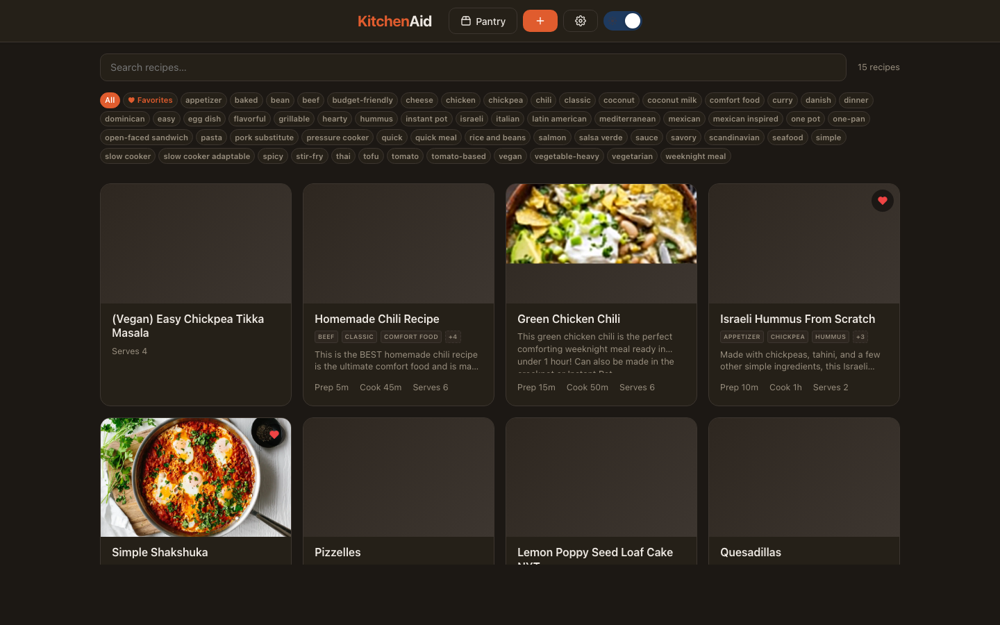
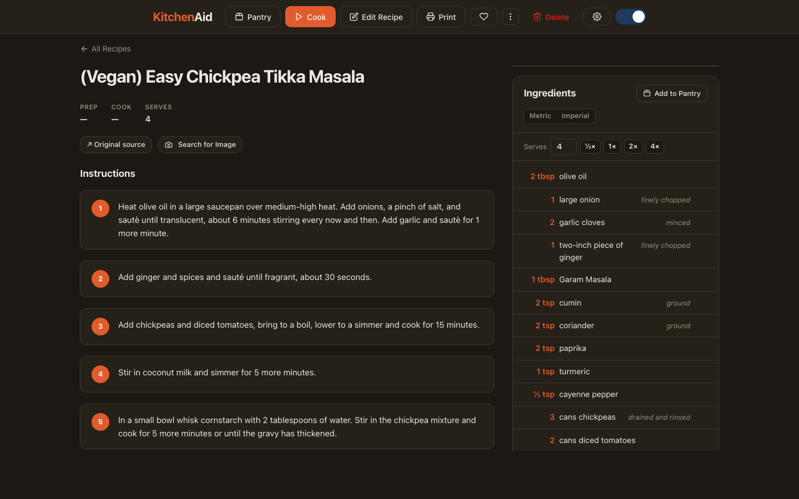
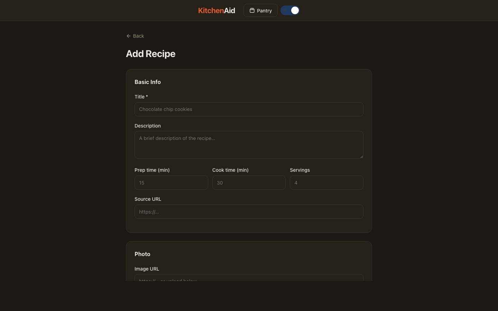
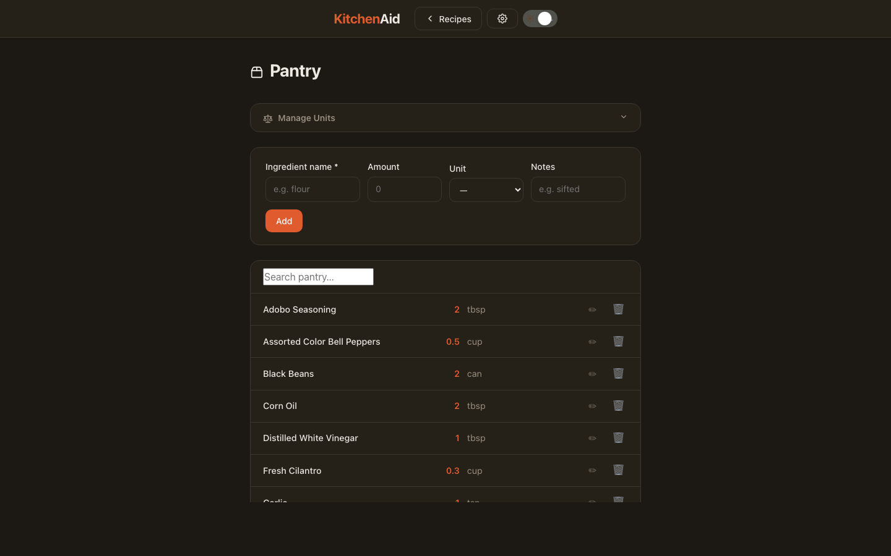
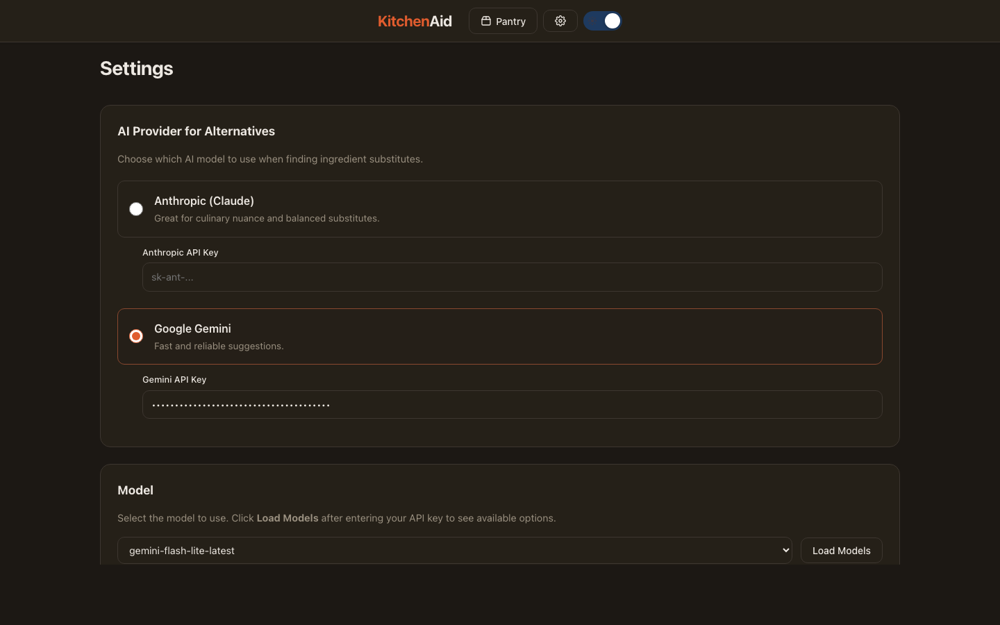

# KitchenAid

A personal recipe book web app. Store, organize, and scale your recipes — with import from URL, image search, pantry tracking, and AI-powered features.



## Features

- **Recipe management** — create, edit, delete, and reorder recipes with ingredients and steps
- **Import** — pull recipes from any URL, paste HTML, plain text, or a photo
- **Scaling** — adjust servings and see ingredient amounts recalculate automatically (metric/imperial)
- **Tags** — tag recipes and filter by tag; AI can suggest tags
- **Image search** — search for a recipe photo and attach it
- **Ingredient alternatives** — AI suggests substitutes for any ingredient
- **Pantry** — track what you have at home; smart-match ingredients across recipes
- **Export** — export a single recipe as JSON or back up / restore the full database
- **Settings** — configure your preferred AI model and unit system

## Screenshots

| Home | Recipe | Add | Pantry | Settings |
|------|--------|-----|--------|----------|
|  |  |  |  |  |

## Stack

- **Backend**: Go, `net/http` (Go 1.22+ routing)
- **Database**: SQLite via `modernc.org/sqlite` (pure Go, no CGO required)
- **Frontend**: Vanilla JS + CSS custom properties, no build step

## Running locally

```bash
export PATH=$PATH:/usr/local/go/bin
go run ./main.go
```

Open [http://localhost:8080](http://localhost:8080).

### Environment variables

| Variable | Default | Description |
|---|---|---|
| `PORT` | `8080` | HTTP port |
| `DB_PATH` | `./kitchenaid.db` | SQLite database path |
| `UPLOADS_DIR` | `./uploads` | Directory for uploaded images |

## Docker

```bash
docker compose up
```

The app is available at [http://localhost:8888](http://localhost:8888). Data and uploads are persisted in `./data/` and `./uploads/`.

## API

All endpoints are prefixed with `/api`.

| Method | Path | Description |
|--------|------|-------------|
| GET | `/api/recipes` | List all recipes |
| POST | `/api/recipes` | Create a recipe |
| GET | `/api/recipes/{id}` | Get a recipe |
| PUT | `/api/recipes/{id}` | Replace a recipe |
| PATCH | `/api/recipes/{id}` | Update fields (title, description, image_url, times, servings) |
| DELETE | `/api/recipes/{id}` | Delete a recipe |
| PUT | `/api/recipes/reorder` | Reorder recipes |
| POST | `/api/recipes/{id}/ingredients` | Add ingredient |
| PUT/PATCH/DELETE | `/api/recipes/{id}/ingredients/{iid}` | Manage ingredient |
| POST | `/api/recipes/{id}/steps` | Add step |
| PUT/DELETE | `/api/recipes/{id}/steps/{sid}` | Manage step |
| POST | `/api/recipes/{id}/tags` | Add tag |
| DELETE | `/api/recipes/{id}/tags/{name}` | Remove tag |
| POST | `/api/recipes/{id}/tags/suggest` | AI-suggest tags |
| GET | `/api/recipes/{id}/export` | Export recipe as JSON |
| POST | `/api/upload` | Upload an image |
| POST | `/api/import/url` | Import recipe from URL |
| POST | `/api/import/html` | Import from HTML |
| POST | `/api/import/text` | Import from plain text |
| POST | `/api/import/image` | Import from image |
| GET | `/api/images/search` | Search for recipe images |
| POST | `/api/alternatives` | Find ingredient alternatives |
| GET | `/api/pantry` | List pantry items |
| POST | `/api/pantry` | Add pantry item |
| POST | `/api/pantry/batch` | Bulk-add pantry items |
| POST | `/api/pantry/merge` | Merge duplicate pantry items |
| PUT/DELETE | `/api/pantry/{id}` | Update / delete pantry item |
| POST | `/api/ai/smart-match` | Match ingredients to pantry |
| GET | `/api/settings` | Get settings |
| PUT | `/api/settings` | Update settings |
| GET | `/api/db/export` | Download full database backup |
| POST | `/api/db/import` | Restore database from backup |
